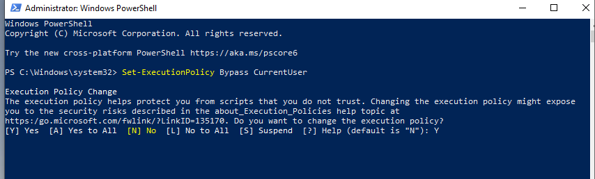
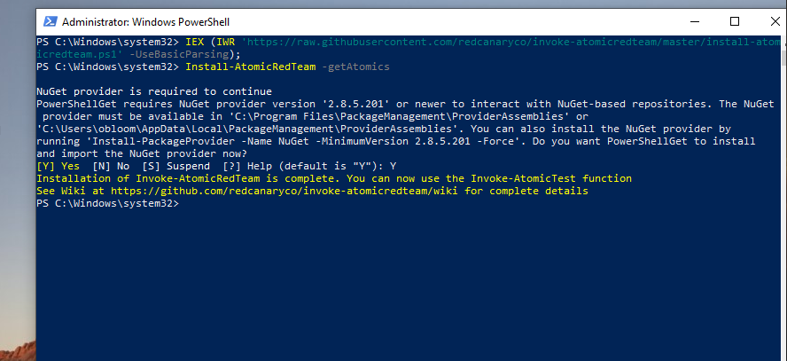
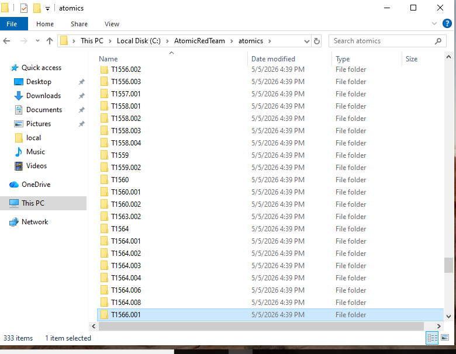
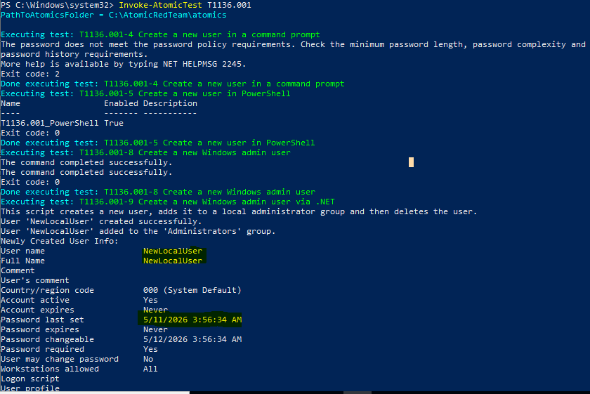
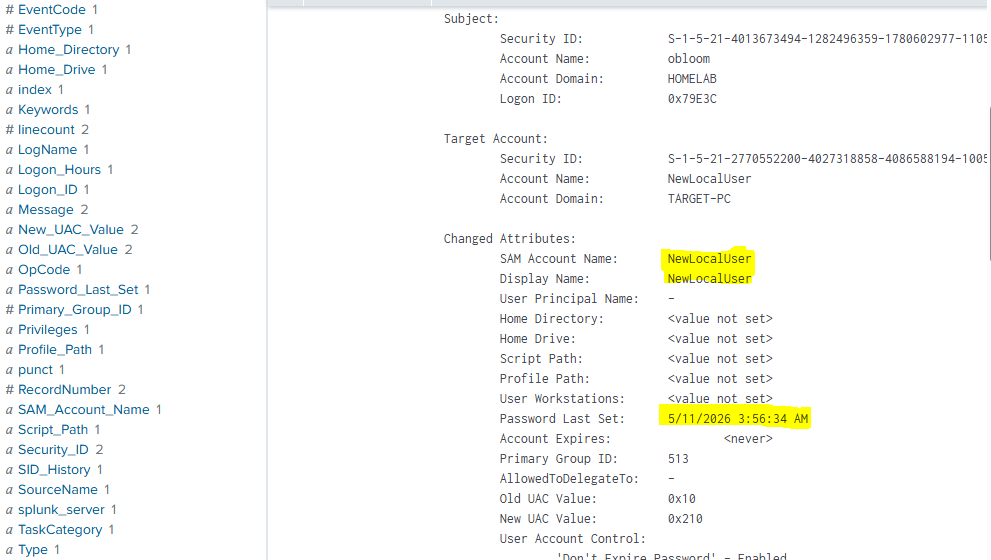
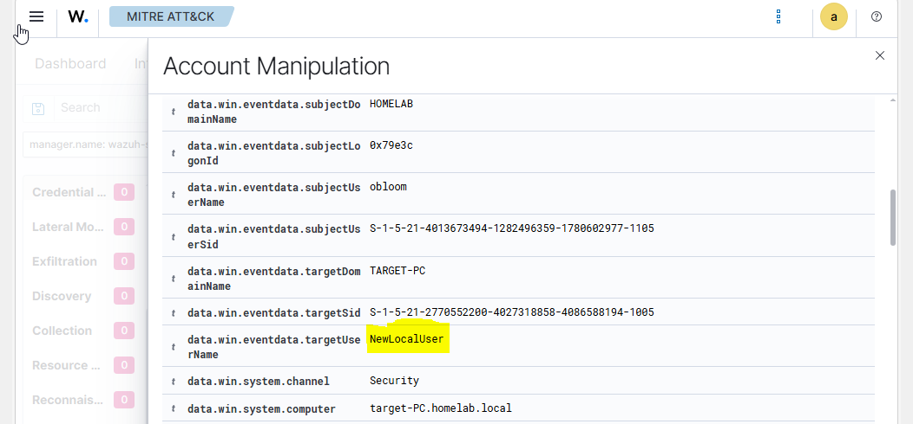

 # INSTALLING ATOMIC RED TEAM FOR LAB ANALYSIS
AtomicRedTeam is an open-source library of small, safe security tests that simulate attacker behaviors mapped to the MITRE ATT&CK framework. 
In simple terms, Atomic Red Team helps defenders safely test whether their security tools can detect real attack techniques. 

My goal is to correctly install Atomic Red Team and execute a simulation in my home lab. A positive result will validate that my detection tools and telemetry are properly configured and functioning as expected.

# Prerequisites and Safety Guidelines
1)	Atomic Red Team should be executed in isolated, controlled lab environments or virtual machines whenever possible. This helps simplify telemetry analysis and reduces the risk of disrupting production systems or business operations.
2)	Only run Atomic Tests on systems you own or are explicitly authorized to assess. Do not perform testing against public infrastructure or third-party environments without permission.
3)	  Avoid using real user or production data during testing. Some Atomic Tests may interact with: 
-	Local user accounts 
-	File systems 
-	Event logs 
-	Network connections 
4)	Review each test before execution to understand its potential system impact and required cleanup actions.
LAB Recommendations
Must have internet access and at least 4 virtual machines for optimal results.
-	Attacking machine ( Kali Linux)
-	Target Machine (Windows) with Sysmon installed
-	Splunk server
-	Wazuh server

 # 🛠️Installing AtomicRedTeam
1) On the Target machine, run PowerShell as Administrator and set the execution policy to bypass.

 

2) Download and Install Invoke-Atomic RedTeam

```powershell
IEX (IWR 'https://raw.githubusercontent.com/redcanaryco/invoke-atomicredteam/master/install-atomicredteam.ps1' -UseBasicParsing)

Install-AtomicRedTeam -GetAtomics
```

 

3) Once installation is complete, the Atomic Red Team files will be located in:

```C:\AtomicRedTeam\atomics ```

 

Et Voila! We now have a properly installed AtomicRedTeam. The objective of this project is to test whether the security tools of the home lab can detect real attack techniques.

# 🎯Attack Simulation with AtomicRedTeam
 I will use a common MITRE ATTACK found on the ```disk C ``` library. Attack T1136: Create a new user account on a system or in a domain to maintain access or move laterally. 
 ```powershell
 Invoke-AtomicTest T1136.001
  ```
 

We will particularly pay attention to the **UserName** and the **date**. This information will be checked in Splunk and Wazuh.


# Simulation Results
**SPLUNK**

Through Splunk investigation, I was able to find my NewLocalUser, and the time it was assigned.

 

**WAZUH**

I was also able to have a result on Wazuh. One advantage of Wazuh is that each alert is mapped to MITRE tactics. This can be automatic or through custom rules.
My alert came under the MITRE Tactic T1078(Valid Accounts: Default Accounts), instead of T1136(Create Account), which I applied on PowerShell. The mapping gives a context to the tactic.

 


🏆# 
In conclusion, I have ; 
- Installed AtomicRedTeam with a list of MITRE ATTACKS on our Target PC
- Executed an attack and monitored it through WAZUH and SPLUNK. Both platforms captured the event. This confirms that my homelab monitoring tools are well configured for threat detection.


# Resources:
- Atomic Red Team GitHub Repository: https://github.com/redcanaryco/atomic-red-team
- Official Atomic Red Team Website: https://atomicredteam.io

